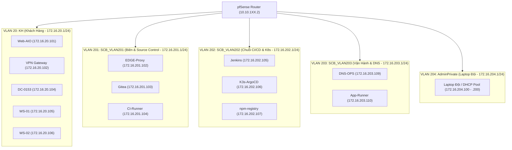

# Kiến Trúc Đấu Trường An Toàn Thông Tin (Arena Cyber Range 2026)

## 1. Tổng Quan Kiến Trúc Mạng (Network Topology)

Sàn đấu an toàn thông tin được thiết kế theo mô hình phân tầng mô phỏng hệ thống ngân hàng / doanh nghiệp đa chi nhánh:

```text
                               +--------------------------------------------+
                               |         HẠ TẦNG BTC (10.10.0.0/24)         |
                               |  Core GW: 10.10.0.1 | DNS: 10.10.0.2       |
                               |  SIEM: 10.10.0.8    | CTFd: 10.10.0.10     |
                               |  SLA Engine: 10.10.0.15                    |
                               +--------------------------------------------+
                                                     |
                                                     v
                               +--------------------------------------------+
                               |             ARENA DISTRIBUTION             |
                               |   Routing: 10.10.101.0/24 - 10.10.127.0/24 |
                               +--------------------------------------------+
                                        /            |             \
                     +-----------------+      +-------------+      +-----------------+
                     | Team 01 Zone    |      | Team 02 ... |      | Team 27 Zone    |
                     | 10.10.101.0/24  |      |             |      | 10.10.127.0/24  |
                     +-----------------+      +-------------+      +-----------------+
```

---

## 2. Phân Bổ Địa Chỉ IP & Phân Vùng Mạng Chi Tiết

### 2.1. Vùng Hạ Tầng BTC (`10.10.0.0/24`)
* **ARENA CORE L3 Router**: `10.10.0.1`
* **ARENA CORE DNS**: `10.10.0.2`
* **SIEM Log Aggregator**: `10.10.0.8` (Cổng 514 Syslog UDP, Cổng 5601 Web UI)
* **CTFd Scoreboard & Flag Portal**: `10.10.0.10` (Cổng 8000 Web UI)
* **SLA Service Checker Engine**: `10.10.0.15` (Cổng 8080 API & Dashboard)

### 2.2. Vùng WAN & Quản Trị Của Từng Đội (`10.10.1XX.0/24` với XX = 01 .. 27)
* **WAN Gateway**: `10.10.1XX.1`
* **pfSense Inter-VLAN Router**: `10.10.1XX.2` (Trunk 802.1Q xuống các VLAN nội bộ)
* **ESXi Host / vCenter**: `10.10.1XX.3` (Các cổng quản trị: 2301, 2302, 2303, 2322)

---

## 3. Kiến Trúc Mạng Nội Bộ Sau pfSense (Mẫu Chung 27 Đội)

Mỗi đội sở hữu 5 VLAN độc lập được định tuyến liên VLAN qua pfSense:



---

## 4. Luồng Dữ Liệu (Traffic Flows)

1. **Luồng Tấn Công (Attack Flow)**:
   $$\text{Team X (AdminPrivate)} \rightarrow \text{pfSense X (out)} \rightarrow \text{Arena Core 10.10.0.0/24} \rightarrow \text{Distribution} \rightarrow \text{pfSense Y} \rightarrow \text{Dịch vụ trong VLAN đối phương}$$
2. **Luồng Quản Trị & Chấm Điểm (Admin & Scoring Flow)**:
   * Nộp Flag: Thí sinh gửi request về `CTFd 10.10.0.10:8000`.
   * SLA Monitoring: `SLA Engine 10.10.0.15` chủ động bắn các gói kiểm tra TCP/HTTP định kỳ ngẫu nhiên (1–10 phút) vào các cổng dịch vụ của 27 đội.
   * Thu thập Log: Toàn bộ pfSense và node gửi Syslog về `SIEM 10.10.0.8:514`.

